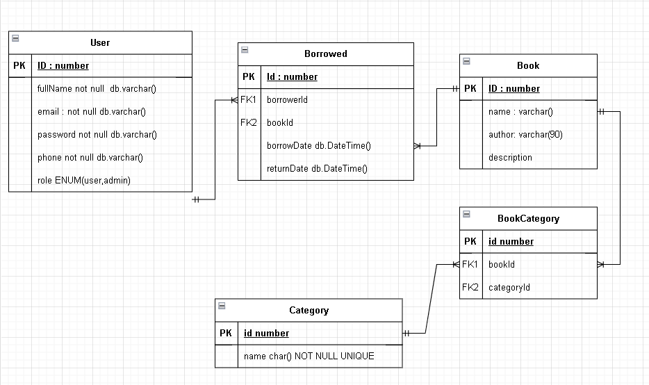

## Description

This repository collect all the source code for interview test. I'm using nest.js as a framework to develop RESTful API which requirement provided by the interviewer.

## ER Diagram

The ER diagram designed for this database


### Seeding

The collection of seed data is in

    path: ./prisma/seed.js

command for seed :

```bash
# seed
$ npx prisma db seed
```

### API Endpoint:

#### Books : /books

| Method | Endpoint                  | Access    | Descrtiption                                      |
| ------ | ------------------------- | --------- | ------------------------------------------------- |
| GET    | /all                      | PUBLIC    | Get all books                                     |
| GET    | /all                      | PUBLIC    | Get all books                                     |
| GET    | /find/:id                 | PUBLIC    | Get the book with provided ID                     |
| GET    | /search?query             | PUBLIC    | Get books with provided query string              |
| GET    | /search/categories/?query | PUBLIC    | Get books with provided categories query string   |
| GET    | /most                     | PUBLIC    | Get the book which has the most borrowed records. |
| POST   | /create                   | PROTECTED | Create book                                       |
| PATCH  | /update/:id               | PROTECTED | Update books with provided ID                     |
| DELETE | /:id                      | PROTECTED | Delete books with provided ID                     |

#### Auth : /auth

| Method | Endpoint     | Access     | Descrtiption              |
| ------ | ------------ | ---------- | ------------------------- |
| GET    | /logout/:id  | PROTECTED  | User logout. remove token |
| GET    | /refresh/:id | PROTECTEED | Refresh refresh token     |
| POST   | /signin      | PUBLIC     | Signin                    |
| POST   | /signup      | PUBLIC     | Sign up                   |

#### User : /users

| Method | Endpoint | Access | Descrtiption    |
| ------ | -------- | ------ | --------------- |
| GET    | /:id     | PUBLIC | Find user by ID |

#### Borrow : /borrow

| Method | Endpoint        | Access    | Descrtiption                       |
| ------ | --------------- | --------- | ---------------------------------- |
| GET    | /search         | PUBLIC    | Find borrow record by query string |
| POST   | /create         | PROTECTED | Create borrow records              |
| PATCH  | /update/:bookId | PROTECTED | Update borrow records.             |

#### .env

    DATABASE_URL

    BCRYPT_SALT

    JWT_ACCESS_SECRET

    JWT_REFRESH_SECRET
